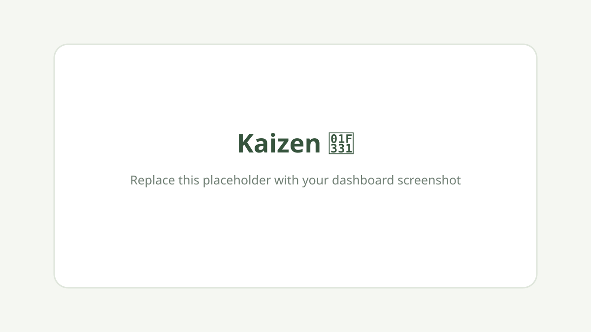

# Kaizen 🌱

Kaizen is a lightweight personal improvement tracker designed around the philosophy of continuous improvement.

Create a private account, track your habits, maintain streaks, record daily reflections, and visualize your progress over time.

## Screenshot



## Features

- Daily habit creation, editing, deletion, and completion
- Daily and best streak tracking
- Automatic progress calculations and motivational messages
- Reflections saved by date
- Seven-day CSS progress chart and daily history
- Responsive light and dark themes
- Private accounts with isolated, persistent data
- Secure password hashing, sessions, CSRF protection, and parameterized SQL

## Tech stack

- HTML5
- CSS3
- Vanilla JavaScript
- Python 3.12
- SQLite locally / PostgreSQL on Vercel
- Psycopg PostgreSQL adapter for production

No frontend framework or build step is required.

## Installation

Python 3.12 or newer is recommended. Clone or download this repository, then start the application server:

```bash
python3 server.py
```

Visit `http://localhost:8000`.

The SQLite database is created automatically at `data/kaizen.db`. To choose another location, set `KAIZEN_DB`. On an HTTPS deployment, set `KAIZEN_SECURE_COOKIE=1` so session cookies are marked `Secure`.

## Deploy to Vercel

1. Import this GitHub repository into Vercel and select the **Other** framework preset.
2. In the Vercel Marketplace, add a PostgreSQL provider such as Neon to the project.
3. Confirm the integration created the `DATABASE_URL` environment variable.
4. Deploy. The required tables are created automatically on the first API request.

Vercel automatically installs `requirements.txt`, runs the API with Python 3.12, serves `public/` as static assets, and marks the session cookie `Secure`. Place the database in a region close to the Vercel Functions.

## Usage

1. Create an account or log in.
2. Select **Add habit** and enter a small daily practice.
3. Check habits as you complete them.
4. Write a short daily reflection; it saves automatically.
5. Review your weekly progress and previous days below.
6. Use the moon or sun button to switch themes.

Each account can only access its own data. Use a strong, unique password.

## Project structure

```text
kaizen/
├── api/                 # Vercel Function entrypoints
├── public/              # HTML, CSS, JavaScript, and assets
├── server.py
├── test_server.py
├── test_stats.js
├── requirements.txt
├── vercel.json
├── README.md
├── LICENSE
└── .gitignore
```

Run the checks with:

```bash
python3 -m unittest -v test_server.py
node test_stats.js
```

## Future roadmap

- GitHub-style contribution calendar
- Achievements and custom habit categories
- Monthly statistics
- Data export and import
- Progressive Web App support
- Optional email verification

## License

Licensed under the [MIT License](LICENSE).
